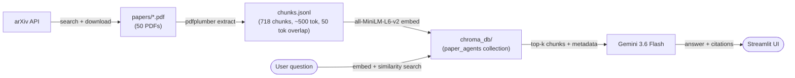
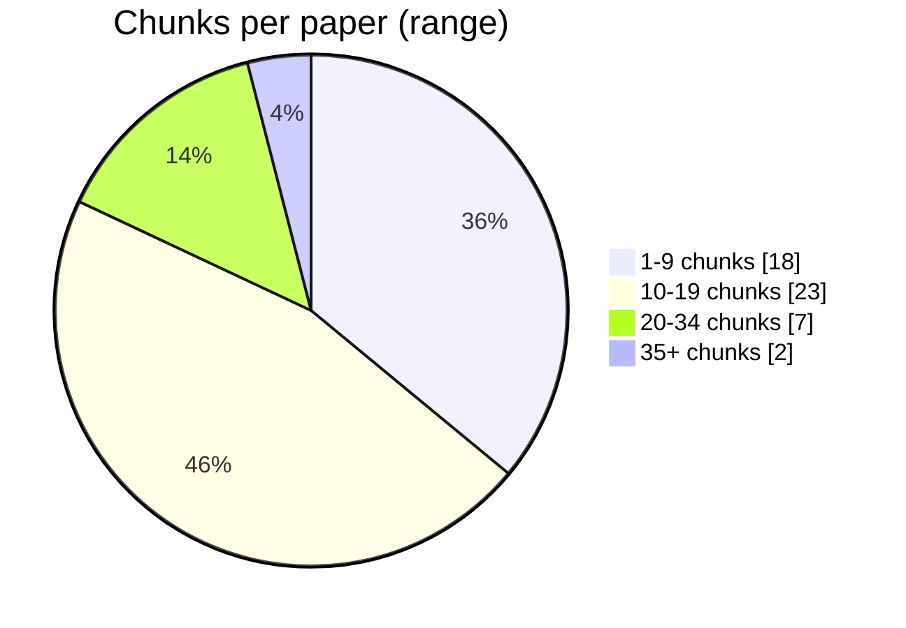

# Paper RAG

A retrieval-augmented Q&A app over 50 arXiv papers on **LLM agents and tool use**. Ask a question in plain English and get an answer grounded strictly in the paper corpus, with inline citations and clickable source links back to arXiv.

**Live app:** [heytanix-paperrag.streamlit.app](https://heytanix-paperrag.streamlit.app/)


---

## How it works



| Stage | Script | Output |
|---|---|---|
| 1. Fetch | [`fetch_papers.py`](fetch_papers.py) | `papers/*.pdf`, `papers_metadata.json` |
| 2. Chunk | [`extract_and_chunk.py`](extract_and_chunk.py) | `chunks.jsonl` |
| 3. Index | [`build_index.py`](build_index.py) | `chroma_db/` (persistent Chroma collection) |
| 4. Query | [`query_engine.py`](query_engine.py) | `answer_question(question, top_k=5)` |
| 5. UI | [`app.py`](app.py) | Streamlit app |

Retrieval is grounded: the LLM is instructed to answer **only** from the retrieved chunks, cite which paper(s) each claim came from, and say so explicitly if the context is insufficient — rather than guessing.

---

## Corpus at a glance

| Metric | Value |
|---|---|
| Papers indexed | 50 |
| Total chunks | 718 |
| Avg. chunks / paper | 14.4 |
| Chunk size | ~500 tokens, 50-token overlap |
| Embedding model | `all-MiniLM-L6-v2` (384-dim) |
| Embedding time (CPU) | ~10 min for full corpus |
| Corpus size on disk | `papers/` 148 MB · `chroma_db/` 33 MB |
| Failed extractions | 0 |

Papers were pulled from arXiv using phrase-restricted queries (`"LLM agent"`, `"tool use"`, `"function calling"`, `"ReAct"`, `"autonomous agent"`, etc.) plus a keyword relevance filter, so every paper in the corpus is genuinely about agentic LLM behavior — not just any paper mentioning "language model."



---

## Running locally

```bash
git clone https://github.com/heytanix/paperRAG.git
cd paperRAG
pip install -r requirements.txt

# create .env with your key
echo 'GEMINI_API_KEY=your-key-here' > .env

streamlit run app.py
```

The repo ships with a prebuilt `chroma_db/`, so the app runs immediately without re-fetching or re-embedding anything. `papers/` and `papers_metadata.json` are not needed at runtime — only `chroma_db/`.

To rebuild the corpus from scratch:

```bash
python3 fetch_papers.py        # arXiv -> papers/, papers_metadata.json
python3 extract_and_chunk.py   # papers/ -> chunks.jsonl
python3 build_index.py         # chunks.jsonl -> chroma_db/
```

`build_index.py` uses `upsert`, so rerunning it after adding more papers is safe — it won't duplicate existing chunks.

---

## Testing without the UI

```bash
python3 query_engine.py "How do LLM agents decide when to call a tool?"
```

Prints the generated answer followed by a numbered list of sources (paper title, page, arXiv ID).

---

## Deployment notes

- `GEMINI_API_KEY` is read from `.env` locally (via `python-dotenv`), or from `st.secrets` on Streamlit Community Cloud — no code changes needed between environments.
- `.streamlit/config.toml` sets `fileWatcherType = "none"` to avoid Streamlit's file watcher churning through `transformers`' large submodule tree on every rerun.
- `.env` is gitignored; secrets are configured via Streamlit Cloud's **Secrets** panel in TOML format.
